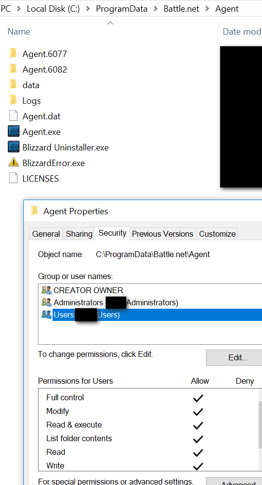
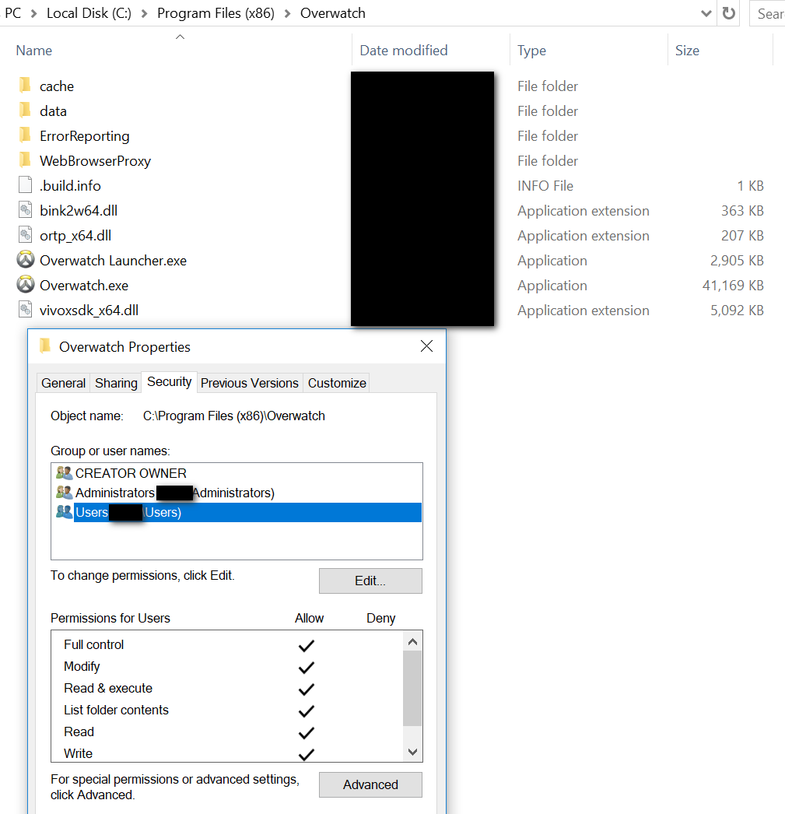

# Blizzard Windows App Privledge Escalation

Due to Blizzard installing their Agent into `ProgramData` and not setting permissions correctly on that folder it allows users to escalate to other users on the system as well as escalate to `SYSTEM` via the Uninstaller

